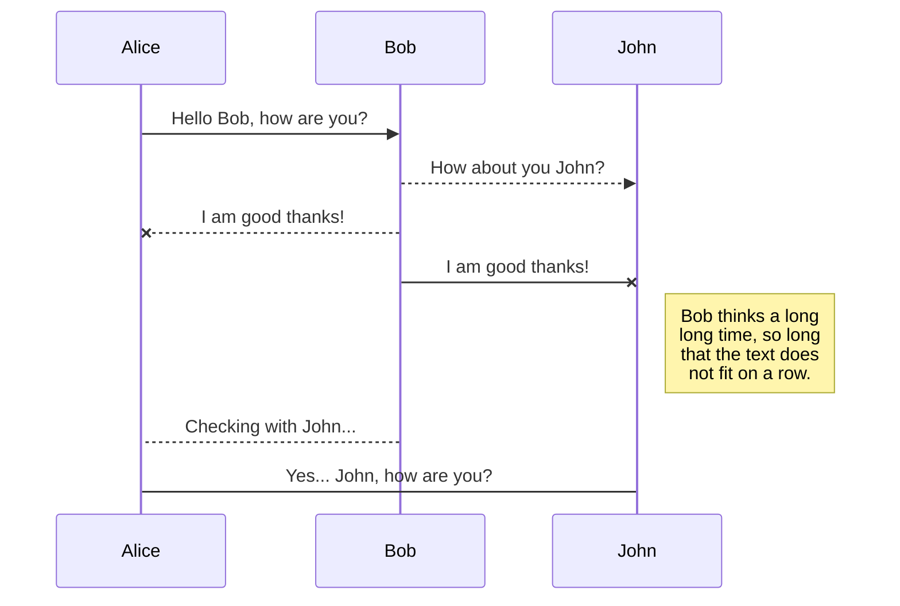

# IBS-HR-Teknik
IBS-HR-Teknik Servis takip uygulaması

| Menu   | Detay(Detail) |
| ------ | ------ |
| Teknik Kayıt | Servis bölümüne gelen cihazların kayıt sistemi |
| Teknik İşlemler | Servise girişi yapılan cihazların işleme alınması |
| Teknik Liste | Teknik işleme alınan cihazlar(tamamlanan ve tamamlanmayan) |
| Hibe Kayıt | Servise(Firmaya) hibe edilme|
| Hibe Liste | Firmaya hibe edilen cihaz kayıtları|
| Servis Kayıt | Dışarı teknik servis kaydı |
| Servis Listesi | Dışarı teknik servis listesi |

Ana Menü(Main Menu)


Hibe Kayıt(grant registration)


Teknik Kayıt(Technical Registration)


Teknik İslemler(Technical Works)


Projede Veri Tabanı olarak SQL Server 2012 kullanılmıştır.


Projedeki bütün veri tabanı tabloları proje içerisinde ana sınıf(class) içerisinde kodla hazırlanmıştır.
Dikkat edilmesi gerek nokta Server bağlantı bilgileri static olarak static Boolean SqlConn fonksiyonu içersinde bulunmaktadır o bilgileri güncellemeniz gerekmektedir.


```c#
//Sql Connection(SQL Server Bağşan Fonksiyonu)
static Boolean SqlConn()
        {
            Boolean processResult = false;
            try
            {
                string dbName = "IBSHR";
                SqlConnection connection = new SqlConnection("server=.\\SQLEXPRESS;database=master; Integrated Security=SSPI");
                SqlCommand command = new SqlCommand("SELECT Count(name) FROM master.dbo.sysdatabases WHERE name=@prmVeritabani", connection);
                command.Parameters.AddWithValue("@prmVeriTabani", dbName);
                connection.Open();

                int sonuc = (int)command.ExecuteScalar();
                if (sonuc != 0)
                {
                    SuccessfulDialog successfulDialog = new SuccessfulDialog();
                    DialogResult dialogResult = successfulDialog.ShowDialog();
                    if (dialogResult == DialogResult.OK)
                    {
                        //do processing
                    }
                    else
                    {
                        //do processing
                    }
                    processResult = true;
                }
                else
                {
                    DialogResult dialogResult = MessageBox.Show("Programı İlk Defa Kullanıdığınız Tespit Edildi.\n Veri Tabanı Kurulumu Yapılsın mı ?", "IBS-HR Teknik Servis", MessageBoxButtons.YesNo);
                    if (dialogResult == DialogResult.Yes)
                    {
                        command.CommandText = "Create Database " + dbName;
                        command.ExecuteNonQuery();
                        connection.Close();
                        string connectionString = "server=.\\SQLEXPRESS; database=IBSHR; integrated security=SSPI; User id = sa; Password=nrkdrk;";
                        using (SqlConnection tolustur = new SqlConnection(connectionString))
                            try
                            {
                                /*Veri tabanında tablolarımızı oluşturuyoruz*/
                                tolustur.Open();
                                /*Teknik Servis kayıt Tablosu*/
                                using (SqlCommand TechnicalRecordCommand = new SqlCommand("CREATE TABLE TechnicalRecord(id int IDENTITY(1,1),owner varchar(100)," +
                                "contact varchar(255),address varchar(255),product varchar(100),delivery_date date,accessory varchar(255),explanation varchar(255));", tolustur))
                                    TechnicalRecordCommand.ExecuteNonQuery();
                                /*Teknik İşlemler tablosu*/
                                using (SqlCommand TechnicalOperationsCommand = new SqlCommand("CREATE TABLE TechnicalOperations(id int IDENTITY(1,1),TRId varchar(100)," +
                                "processed bit,approval bit,operation varchar(100),reception_date date,fee varchar(255),completion_date date,operations_carried varchar(255)," +
                                "forwarding bit,referral_clarification varchar(255),delivery bit); ", tolustur))
                                    TechnicalOperationsCommand.ExecuteNonQuery();
                                /*Hibe İşlemler tablosu*/
                                using (SqlCommand GrantOperationsCommand = new SqlCommand("CREATE TABLE GrantOperations(id int IDENTITY(1,1),owner varchar(100)," +
                                "product varchar(100),confirmation bit,contact varchar(100),reception_date date,approval_holder varchar(100),address varchar(100),why varchar(255)); ", tolustur))
                                    GrantOperationsCommand.ExecuteNonQuery();
                                /*Teknik servis dışarı tablosu*/
                                using (SqlCommand GrantOperationsCommand = new SqlCommand("CREATE TABLE TechnicalService(id int IDENTITY(1,1),service_claimant varchar(100)," +
                               "contact varchar(100),address varchar(100),product varchar(100),appointment_date date,fault varchar(255),fault_description varchar(255)); ", tolustur))
                                    GrantOperationsCommand.ExecuteNonQuery();

                                ProvinceInstallationDialog provinceInstallationDialog = new ProvinceInstallationDialog();
                                DialogResult dialogResult1 = provinceInstallationDialog.ShowDialog();
                                if (dialogResult1 == DialogResult.OK)
                                {
                                    //do processing
                                }
                                else
                                {
                                    //do processing
                                }
                                processResult = true;
                            }
                            catch (Exception ex)
                            {
                                MessageBox.Show("Kurgu Hazırlanırken Hata." + ex.Message);
                                processResult = false;
                            }
                    }
                    else if (dialogResult == DialogResult.No)
                    {
                        processResult = false;
                    }
                }
                connection.Close();
            }
            catch (Exception ex)
            {
                MessageBox.Show("Yerel Sunucu İle Bağlantı Başarısız. \n" + ex.Message);
                MessageBox.Show("Yerel Sunucu Bağlantısı Başarısız. Giriş Yapılamaz.");
                processResult = false;
            }
            return processResult;
        }
```
2. try catch bloğu içerisinde 
```c#
/*Teknik servis dışarı tablosu*/
using (SqlCommand GrantOperationsCommand = new SqlCommand("CREATE TABLE TechnicalService(id int IDENTITY(1,1),service_claimant varchar(100)," +
"contact varchar(100),address varchar(100),product varchar(100),appointment_date date,fault varchar(255),fault_description varchar(255)); ", tolustur))
GrantOperationsCommand.ExecuteNonQuery();
```
şeklinde bir kod parçası bulunmaktadır. Bu kod parçası Teknik Servis Dışarı tablosu(TechnicalService)nu oluşturuyor.
Bu kodlarda görüldüğü gibi tablo sütunları ve sütun özellikleri belirlenmiş durumda. İsteğe göre bu özellikler güncellenebilir.
Bu kodlama yöntemi sayesinde Sql Server'ı açmaya gerek kalmaksızın tabloları ve tablo detaylarını ayarlamamız mümkün hale geldi.



